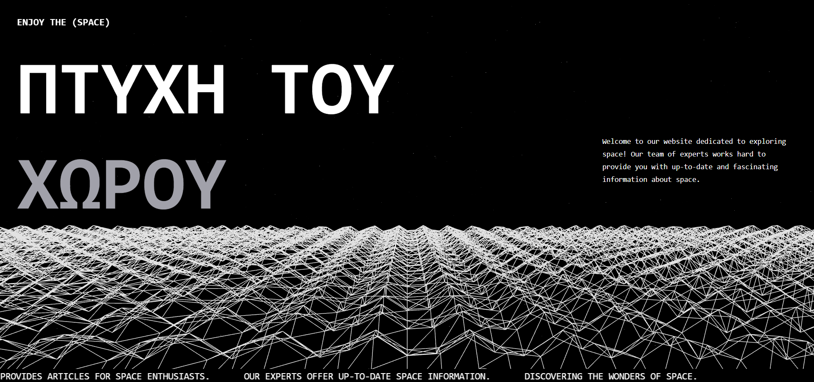

# **The Beat of Space** 🌌  

Welcome to **The Beat of Space**, an immersive space exploration website built with **Remix** and **Three.js**! This project creates an interactive experience where users can explore a spacetime-inspired design with dynamic parallax effects.

  

---

## **Tech Stack**

- **Remix**: For building server-rendered React applications.
- **Three.js** & **@react-three/fiber**: To render and manage the 3D scene.
- **@react-three/drei**: A helper library for Three.js components like stars.
- **Tailwind CSS**: For styling and responsive design.
- **TypeScript**: Ensuring type safety and a better developer experience.

---

## **Features**

- **Dynamic Spacetime Fabric**: A responsive, interactive 3D fabric built with Three.js.
- **Responsive Design**: Powered by Tailwind CSS to ensure seamless viewing across all devices.
- **Parallax Scrolling**: The 3D scene moves dynamically based on user scroll.
- **Sliding Track**: A visually appealing sliding text effect at the bottom.

---

## **Development**

Run the development server to start working on the project:

```sh
npm run dev
